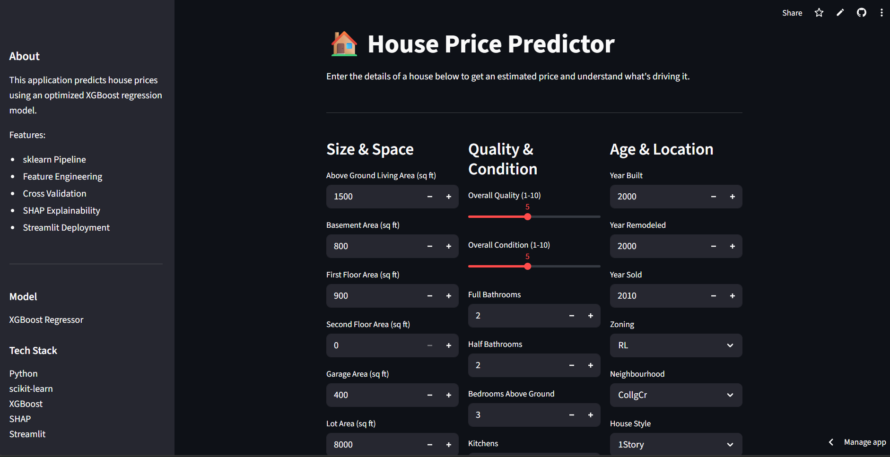
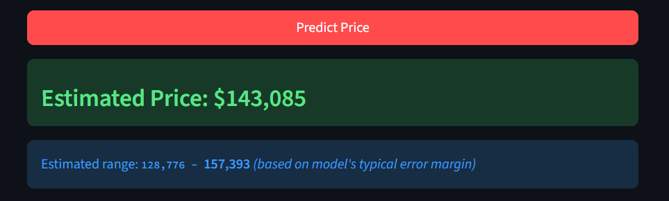
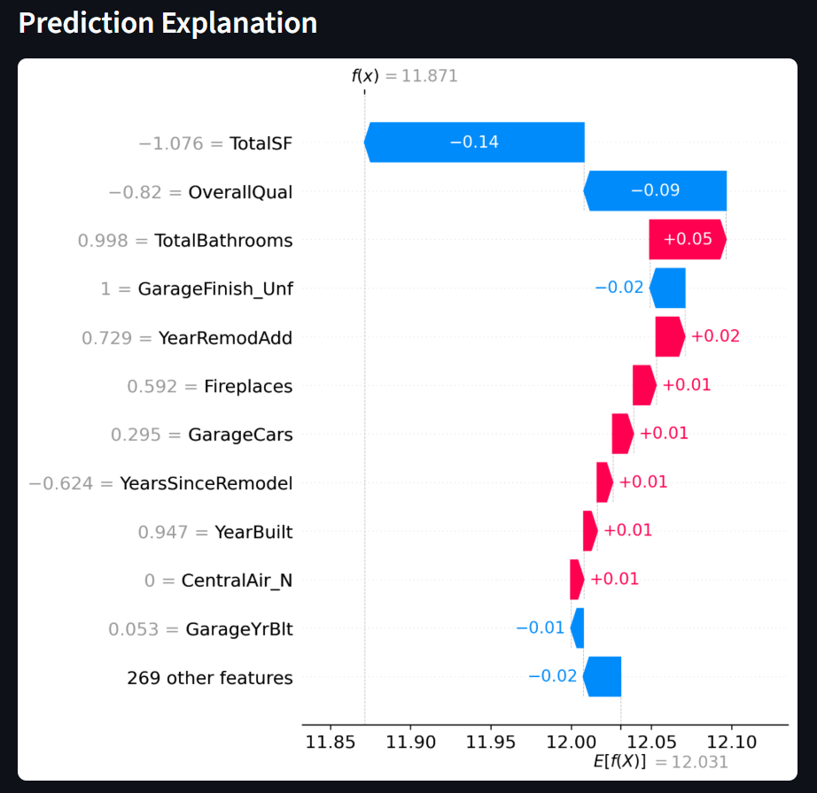

# 🏠 House Price Prediction — Advanced ML Regression


A complete end-to-end machine learning and deployment project that predicts house sale prices using the [Kaggle House Prices: Advanced Regression Techniques](https://www.kaggle.com/competitions/house-prices-advanced-regression-techniques) dataset. The project covers everything from raw data ingestion to deployment-oriented inference — with a strong emphasis on clean preprocessing pipelines, domain-informed feature engineering, rigorous model evaluation, hyperparameter tuning, and SHAP-based explainability.

> **Kaggle score improved from 0.155 → 0.134** using an optimized XGBoost model with a full sklearn Pipeline.

---

## 🚀 Live Demo

🔗 Streamlit App:  
https://xgboost-house-price-predictor.streamlit.app

### Input Form


### Prediction Output


### SHAP Explanation


## 📑 Table of Contents

- [Project Overview](#-project-overview)
- [Project Structure](#-project-structure)
- [Dataset](#-dataset)
- [Installation](#️-installation)
- [Workflow](#️-workflow)
  - [1. Data Preprocessing](#1-data-preprocessing)
  - [2. Feature Engineering](#2-feature-engineering)
  - [3. Modeling Pipeline](#3-modeling-pipeline)
  - [4. Hyperparameter Tuning](#4-hyperparameter-tuning)
  - [5. Evaluation Strategy](#5-evaluation-strategy)
  - [6. Model Explainability (SHAP)](#6-model-explainability-shap)
- [Results](#-results)
- [Visualizations](#-visualizations)
- [Challenges & Solutions](#️-challenges--solutions)
- [Tech Stack](#-tech-stack)
- [Future Improvements](#-future-improvements)
- [Acknowledgements](#-acknowledgements)

---

## 📌 Project Overview

House price prediction is a classic regression problem that demands careful attention to messy real-world data: missing values, skewed distributions, categorical variables with high cardinality, and the risk of data leakage. This project addresses all of these systematically.

**Key goals:**
- Build a robust, production-style sklearn `Pipeline` that handles all preprocessing steps end-to-end
- Engineer meaningful features from raw columns using domain knowledge about real estate
- Compare multiple regression models and select the best performer using cross-validation
- Tune hyperparameters using `GridSearchCV` to push performance further
- Explain model predictions at both global and individual levels using SHAP values

---

## 📂 Project Structure

```
house-price-predictor/
│
├── data/
│   ├── train.csv                  # Training data (1460 samples, 81 features)
│   └── test.csv                   # Test data for Kaggle submission
│
├── models/
│   ├── house_price_pipeline.pkl   # Serialized final pipeline
│   ├── feature_columns.pkl        # All feature column names after engineering
│   ├── numerical_cols.pkl         # Numerical column names
│   └── categorical_cols.pkl       # Categorical column names
│
├── plots/
│   ├── Distribution_of_SalePrice_after_Log_Transformation.png
│   ├── Correlation_Heat_Map.png
│   ├── Actual_vs_Predicted_Prices(XGBoost).png
│   ├── residual_analysis.png
│   ├── shap_global.png
│   ├── shap_dot.png
│   └── shap_individual.png
│
├── house_price.py                 # Model training & evaluation pipeline
├── app.py                         # Streamlit deployment app with SHAP explanations
├── submission.csv                 # Kaggle submission file
├── requirements.txt
└── README.md
```

---

## 📊 Dataset

The dataset comes from the [Kaggle House Prices competition](https://www.kaggle.com/competitions/house-prices-advanced-regression-techniques/data).

| Split | Samples | Features |
|---|---|---|
| Train | 1,460 | 81 (including target) |
| Test | 1,459 | 80 (no target) |

- **Target variable:** `SalePrice` — the sale price of the house in USD
- **Feature types:** 43 numeric + 37 categorical (before engineering)
- **Missing values:** Several columns have significant missing data (e.g. `PoolQC`, `Alley`, `MiscFeature` are missing in >90% of rows)

---

## ⚙️ Installation

**1. Clone the repository**

```bash
git clone https://github.com/Hisham-05/house-price-predictor.git
cd house-price-predictor
```

**2. Install dependencies**

```bash
pip install -r requirements.txt
```

**3. Add the data**

Download `train.csv` and `test.csv` from the [Kaggle competition page](https://www.kaggle.com/competitions/house-prices-advanced-regression-techniques/data) and place them in the `data/` directory.

**4. Run training**

```bash
python house_price.py
```

This will train all models, run cross-validation, save the best pipeline to `models/`, generate all plots to `plots/`, and write `submission.csv`.

---

## 🛠️ Workflow

### 1. Data Preprocessing

Raw housing data is messy — multiple columns have missing values, the target is heavily right-skewed, and features span very different scales. The following steps were applied:

**Target transformation**

`SalePrice` has a strong right skew (a few very expensive homes pull the distribution). Applying `log1p` makes the target distribution more symmetric, helps stabilize variance, reduces the influence of outliers, and can improve learning behavior for many regression models.

```python
df['SalePrice'] = np.log1p(df['SalePrice'])
```

Predictions are inverse-transformed using `np.expm1()` before submission.

**Dropping high-missingness columns**

Columns with more than 50% missing values are dropped before any imputation. These columns (e.g. `PoolQC`, `Alley`, `MiscFeature`) have too little signal to be worth imputing.

```python
threshold = 0.5
df = df[df.columns[df.isnull().mean() < threshold]]
```

**Imputation inside the Pipeline**

Remaining missing values are handled inside the sklearn `Pipeline` to prevent data leakage — the imputer is fit only on training data and transforms test data using those statistics:

- **Numerical columns** → `SimpleImputer(strategy='median')` (robust to outliers)
- **Categorical columns** → `SimpleImputer(strategy='most_frequent')` followed by `OneHotEncoder(handle_unknown='ignore')`

---

### 2. Feature Engineering

Raw features were extended with 10 domain-informed engineered features that capture real estate concepts more directly than individual columns:

| Feature | Formula / Logic | Rationale |
|---|---|---|
| `TotalSF` | `TotalBsmtSF + 1stFlrSF + 2ndFlrSF` | Total livable area is a strong predictor of price |
| `TotalBathrooms` | `FullBath + 0.5*HalfBath + BsmtFullBath + 0.5*BsmtHalfBath` | Weighted sum gives a continuous bathroom count |
| `TotalPorchSF` | Sum of all porch area columns | Aggregates outdoor living space |
| `HouseAge` | `YrSold - YearBuilt` | Older houses generally sell for less |
| `YearsSinceRemodel` | `YrSold - YearRemodAdd` | Recent remodels add value |
| `IsRemodeled` | `1 if YearRemodAdd != YearBuilt else 0` | Binary flag for any remodel |
| `HasBasement` | `1 if TotalBsmtSF > 0 else 0` | Presence/absence of basement |
| `HasGarage` | `1 if GarageArea > 0 else 0` | Presence/absence of garage |
| `Has2ndFloor` | `1 if 2ndFlrSF > 0 else 0` | Two-storey vs single-storey |
| `IsNew` | `1 if HouseAge <= 2 else 0` | New builds often command a premium |

---

### 3. Modeling Pipeline

All models are wrapped in a reusable sklearn `Pipeline` that chains preprocessing and the estimator together. This ensures:
- No data leakage (preprocessing is fit inside cross-validation folds, not before)
- Easy serialization with `joblib` for deployment
- Clean, reproducible code

```
ColumnTransformer
├── numerical: SimpleImputer(median) → StandardScaler
└── categorical: SimpleImputer(most_frequent) → OneHotEncoder(handle_unknown='ignore')
         ↓
    Estimator (LR / RF / XGBoost)
```

Three models were trained and compared:

| Model | Purpose |
|---|---|
| `LinearRegression` | Baseline — establishes a minimum viable performance benchmark |
| `RandomForestRegressor` | Non-linear ensemble comparison |
| `XGBRegressor` | Final model — gradient boosted trees with regularization |

---

### 4. Hyperparameter Tuning

`GridSearchCV` with 5-fold cross-validation was used to optimize XGBoost hyperparameters on the training set:

```python
param_grid = {
    'model__n_estimators': [100, 200],
    'model__max_depth': [3, 5, 7],
    'model__learning_rate': [0.05, 0.1]
}
```

The scoring metric used is `neg_root_mean_squared_error` (RMSE on log-transformed prices), which matches the Kaggle competition's evaluation metric.

---

### 5. Evaluation Strategy

A multi-layered evaluation approach was used to ensure reliable, unbiased performance estimates:

- **80/20 train/test split** — a held-out test set is never seen during training or tuning
- **5-fold cross-validation** on the training set — used for model selection and hyperparameter tuning
- **CV score ≈ holdout score** — confirms the model generalizes and isn't overfitting

Metrics reported:

| Metric | Description |
|---|---|
| **MAE** | Mean Absolute Error — average prediction error in dollars (interpretable) |
| **RMSE** | Root Mean Squared Error — penalizes large individual errors more heavily |
| **R²** | Coefficient of determination — proportion of variance explained by the model |

---

### 6. Model Explainability (SHAP)

[SHAP (SHapley Additive exPlanations)](https://shap.readthedocs.io/) was used to explain model predictions at both global and individual levels. This makes the model auditable and trustworthy.

**Three levels of explanation were generated:**

**Global bar chart (`shap_global.png`)**
Shows the mean absolute SHAP value for each feature across all predictions — which features matter most on average across the entire dataset.

**Dot plot (`shap_dot.png`)**
Shows the direction and magnitude of each feature's impact for every individual prediction. Red = high feature value, blue = low. Allows you to see not just *which* features matter, but *how* they matter.

**Waterfall plot (`shap_individual.png`)**
Explains a single prediction in full detail — starts from the model's base value (average prediction) and shows exactly how each feature pushed the prediction up or down to reach the final output.

**Top contributing features identified by SHAP:**
1. `OverallQual` — overall material and finish quality
2. `TotalSF` — total square footage (engineered feature)
3. `GarageCars` — garage capacity
4. `HouseAge` — age of the house at time of sale

---

## 📈 Results

### Model Comparison

| Model | MAE ($) | RMSE ($) | R² Score |
|---|---|---|---|
| Linear Regression | 17,061 | 63,440 | 0.84 |
| Random Forest | 17,601 | 30,434 | 0.87 |
| **XGBoost (final)** | **15,901** | **27,868** | **0.90** |

### Kaggle Submission

| Stage | Score (RMSE, log scale) |
|---|---|
| Initial model | 0.155 |
| **Final model (tuned XGBoost)** | **0.134** |

> A lower score is better. The improvement from 0.155 → 0.134 represents a ~14% reduction in prediction error on the public leaderboard.

---

## 🖼️ Visualizations

All plots are saved to the `plots/` directory after running `house_price.py`.

### SalePrice Distribution (After Log Transformation)
Confirms that log1p makes the target distribution approximately normal — reducing the influence of expensive outlier houses on training.


---

### Correlation Heat Map
Pearson correlations between all numerical features. Shows which features are most linearly related to SalePrice — useful for understanding raw feature relevance before modeling.


---

### Actual vs Predicted Prices
Scatter plot of predicted vs actual sale prices on the holdout set. Points hugging the red diagonal line indicate accurate predictions. Scatter above the line = underestimated. Scatter below = overestimated.

.png)

---

### Residual Analysis
Three-panel diagnostic plot showing where and how the model fails:
- **Left** — Actual vs Predicted (overall accuracy)
- **Middle** — Residuals vs Predicted (checks for systematic bias — should be random scatter around zero)
- **Right** — Residual Distribution (should be a bell curve centred at zero)


---

### SHAP Global Feature Importance
Bar chart showing mean absolute SHAP value per feature across all holdout predictions. Bar length = how much that feature moves predictions on average, regardless of direction.


---

### SHAP Dot Plot
Each dot is one house. Position on the x-axis shows how much that feature pushed the prediction up or down. Colour shows the feature value — red = high, blue = low. Validates that the model learned sensible real-world relationships (e.g. high TotalSF → higher price).


---

### SHAP Individual Prediction (Waterfall)
Explains a single prediction in full detail. Starts from the model's base value (average predicted price) and shows exactly how each feature pushed the prediction up or down to reach the final output.


| Plot | Description |
|---|---|
| `Distribution_of_SalePrice_after_Log_Transformation.png` | Confirms that log1p makes the target distribution approximately normal |
| `Correlation_Heat_Map.png` | Pearson correlations between all numerical features and SalePrice |
| `Actual_vs_Predicted_Prices(XGBoost).png` | Scatter plot of predicted vs actual sale prices on the holdout set |
| `residual_analysis.png` | Residuals vs predicted values — checks for patterns or heteroscedasticity |
| `shap_global.png` | Global feature importance via mean absolute SHAP values |
| `shap_dot.png` | SHAP dot plot showing direction and magnitude per feature per sample |
| `shap_individual.png` | Waterfall chart explaining a single house's predicted price |

---

## ⚠️ Challenges & Solutions

| Challenge | Solution |
|---|---|
| **Skewed target variable** | Applied `log1p` transformation before training; inverse-transformed with `expm1` for submission |
| **Data leakage** | All preprocessing steps (imputation, scaling, encoding) run inside the sklearn `Pipeline`, fit only on training data |
| **Inconsistent preprocessing across train/test** | The same fitted `Pipeline` object is used for both training evaluation and test set inference |
| **High-missingness columns** | Dropped columns with >50% missing values before pipeline entry; remaining gaps handled by `SimpleImputer` |
| **Overfitting** | 5-fold CV used throughout; final CV score closely matches the held-out test score, confirming generalization |
| **Hyperparameter search cost** | `GridSearchCV` run with 5-fold CV scoped to the most impactful XGBoost parameters |

---

## 🧰 Tech Stack

| Library | Version | Usage |
|---|---|---|
| Python | 3.10 | Core language |
| pandas | latest | Data loading, manipulation, feature engineering |
| NumPy | latest | Numerical operations, log transformations |
| scikit-learn | latest | Pipeline, imputers, encoders, scaler, cross-validation, GridSearchCV, LinearRegression, RandomForest |
| XGBoost | latest | Final regression model |
| SHAP | latest | Model explainability — global, local, and waterfall plots |
| Matplotlib | latest | Base plotting |
| Seaborn | latest | Heatmaps and distribution plots |
| Joblib | latest | Model serialization (.pkl) |

---

## 🔮 Future Improvements

- **Target encoding** for high-cardinality categorical features (e.g. `Neighborhood`) instead of one-hot encoding — reduces dimensionality and captures ordinal price signal
- **Additional feature engineering** — price per square foot, neighbourhood average age, interaction terms between quality and size
- **Model ensembling** — stacking XGBoost and Random Forest predictions with a meta-learner (Ridge regression) for further accuracy gains
- **Optuna for hyperparameter search** — replace grid search with Bayesian optimization for a more efficient and thorough search

---

## 🙌 Acknowledgements

- [Kaggle — House Prices: Advanced Regression Techniques](https://www.kaggle.com/competitions/house-prices-advanced-regression-techniques) for the dataset and competition benchmark
- [scikit-learn](https://scikit-learn.org/) — Pipeline, preprocessing, and model evaluation utilities
- [XGBoost](https://xgboost.readthedocs.io/) — gradient boosting framework
- [SHAP](https://shap.readthedocs.io/) — model explainability library by Scott Lundberg

---

*Built and deployed by [Hisham](https://github.com/Hisham-05)*
